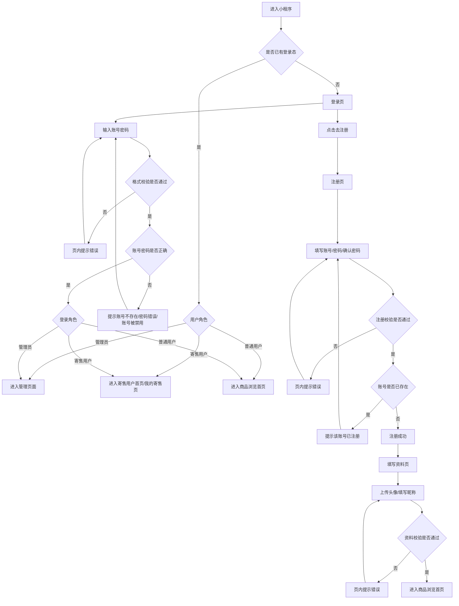

# 谷圈星社小程序｜注册登录功能交互稿

## 1. 文档说明

本文基于 `产品设计文档.md` 中已确认的账号体系规则，输出当前版本「注册 / 登录 / 填写资料」模块的**交互与开发同步稿**，用于产品评审、UI 设计、开发对齐和测试验收。

截至 2026-06-16，该模块已完成小程序页面开发，并统一通过 `auth` 云函数处理登录、注册、资料更新、修改密码、管理员重置密码：

| 页面 | 路由 | 当前状态 |
|---|---|---|
| 登录页 | `auth/pages/login/login` | 已开发 |
| 注册页 | `auth/pages/register/register` | 已开发 |
| 填写资料页 | `auth/pages/profile/profile` | 已开发 |

🟩 服务端调用口径：
- 登录：`authService.login(account, password)`
- 注册：`authService.register(account, password)`
- 更新资料：`authService.updateProfile(userId, nickname, avatarUrl)`
- 修改密码：`authService.changePassword(userId, oldPassword, newPassword)`
- 管理员重置密码：`authService.adminResetPassword(requesterUserId, targetUserId, "123456")`
- 云函数未部署时提示"云函数未部署，请先上传 auth 云函数"。
- 权限异常时提示"暂无操作权限，请联系管理员"。
- 网络异常时提示"网络异常，请稍后重试"。

---

## 2. 设计范围

本次设计包含以下 3 个页面：

1. 登录页
2. 注册页
3. 填写资料页

不包含以下内容：

1. 忘记密码
2. 微信授权登录
3. 手机号验证码登录
4. 第三方登录
5. 寄售用户身份申请流程

---

## 3. 设计目标

### 3.1 核心目标

1. 帮助用户快速完成账号登录与注册
2. 保证账号、密码、昵称等信息校验清晰可理解
3. 降低首次注册用户的操作成本
4. 区分管理员与普通注册用户的进入路径

### 3.2 交互原则

1. **少选择**：注册页不选择角色，默认注册为普通用户
2. **强反馈**：输入错误、提交中、成功失败都需要明确提示
3. **低打断**：优先使用页内提示，减少频繁弹窗
4. **易返回**：登录与注册之间可快速切换
5. **先注册后补资料**：资料页只在普通用户注册成功后触发

---

## 4. 用户流程总览



---

## 5. 全局交互规范

## 5.1 页面风格建议

1. 整体采用简洁、轻量的小程序表单结构
2. 主操作按钮固定为高强调样式
3. 次级入口使用文本按钮或弱按钮
4. 表单错误信息统一出现在输入框下方

## 5.2 通用组件规则

### 输入框

1. 默认态：展示占位文案
2. 聚焦态：边框高亮
3. 错误态：边框变红，输入框下方显示错误文案
4. 当用户修改内容后，当前字段错误提示自动消失

### 按钮

1. 未填写完整或校验未通过时，主按钮置灰不可点
2. 点击提交后，按钮进入 loading 状态
3. loading 期间禁止重复点击

### 提示方式

1. **字段格式问题**：输入框下方红字提示
2. **提交结果问题**：优先页内提示，必要时补充 toast
3. **成功结果**：短暂成功反馈后自动跳转

## 5.3 校验触发时机

1. 输入框失焦时，执行单字段校验
2. 点击“登录 / 注册 / 完成”按钮时，执行全量校验
3. 服务端校验结果返回后，显示账号是否存在、密码是否错误等结果

## 5.4 登录态规则

1. 登录成功后记录登录态
2. 下次打开小程序时，如登录态有效，直接进入对应首页
3. 退出登录后，清除登录态并返回登录页

---

## 6. 页面一：登录页交互稿

## 6.1 页面目标

让已有账号用户通过账号密码登录系统，并根据角色进入对应页面。

## 6.2 页面结构

```text
┌──────────────────────────────┐
│            谷圈星社           │
│      欢迎回来，请先登录        │
│                              │
│  账号                         │
│  [ 请输入账号              ]   │
│  错误提示区域                  │
│                              │
│  密码                         │
│  [ 请输入密码          显示 ]  │
│  错误提示区域                  │
│                              │
│  [        登录中 / 登录       ] │
│                              │
│      没有账号？ 去注册         │
└──────────────────────────────┘
```

## 6.3 页面元素说明

| 元素 | 说明 | 交互 |
| --- | --- | --- |
| 产品名称 | 展示“谷圈星社” | 固定展示 |
| 副标题 | 辅助说明当前页用途 | 固定展示 |
| 账号输入框 | 输入账号 | 支持字母、数字输入 |
| 密码输入框 | 输入密码 | 默认密文，支持显示/隐藏 |
| 登录按钮 | 主操作 | 校验通过后可点击 |
| 去注册入口 | 次操作 | 跳转注册页 |

## 6.4 默认态

1. 页面初次进入时，账号、密码输入框为空
2. 登录按钮默认为置灰不可点击
3. 密码默认隐藏
4. 页面底部显示“没有账号？去注册”

## 6.5 输入交互

### 账号输入框

1. 占位文案：`请输入账号`
2. 输入过程中不过早报错
3. 失焦时校验：
   - 为空：`请输入账号`
   - 非 admin 且不符合 6-12 位数字字母组合：`账号需为6-12位数字和字母组合`

### 密码输入框

1. 占位文案：`请输入密码`
2. 默认密文显示
3. 右侧提供“显示 / 隐藏”切换按钮
4. 失焦时校验：
   - 为空：`请输入密码`
   - 格式错误：`密码需为6-12位数字或字母`

## 6.6 按钮交互

### 登录按钮可点击条件

同时满足以下条件时高亮可点击：

1. 账号非空
2. 密码非空
3. 前端格式校验通过

### 登录按钮点击后

1. 按钮文案变为 `登录中`
2. 按钮显示 loading 状态
3. 禁止重复点击
4. 提交成功或失败后恢复按钮状态

## 6.7 登录结果反馈

### 成功

1. 登录成功后短暂提示：`登录成功`
2. 按角色跳转：
   - 管理员：管理页面
   - 寄售用户：寄售用户首页或“我的寄售”
   - 普通用户：商品浏览首页

### 失败

| 场景 | 提示位置 | 提示文案 |
| --- | --- | --- |
| 账号为空 | 账号框下方 | 请输入账号 |
| 密码为空 | 密码框下方 | 请输入密码 |
| 账号格式错误 | 账号框下方 | 账号需为6-12位数字和字母组合 |
| 密码格式错误 | 密码框下方 | 密码需为6-12位数字或字母 |
| 账号不存在 | 表单下方或 toast | 账号不存在，请先注册 |
| 密码错误 | 密码框下方或 toast | 密码错误，请重新输入 |
| 账号被禁用 | 表单下方 | 账号已被禁用，请联系管理员 |

## 6.8 页面跳转

1. 点击 `去注册` → 跳转注册页
2. 已登录用户重新进入小程序 → 直接进入对应首页，不再展示登录页

---

## 7. 页面二：注册页交互稿

## 7.1 页面目标

帮助新用户创建账号。当前注册成功后默认创建为普通用户账号。

## 7.2 页面结构

```text
┌──────────────────────────────┐
│          注册账号             │
│     创建账号后即可开始使用     │
│                              │
│  账号                         │
│  [ 请输入6-12位账号       ]   │
│  错误提示区域                  │
│                              │
│  密码                         │
│  [ 请输入6-12位密码    显示 ]  │
│  错误提示区域                  │
│                              │
│  再次输入密码                  │
│  [ 请再次输入密码       显示 ] │
│  错误提示区域                  │
│                              │
│  [       注册中 / 注册       ] │
│                              │
│      已有账号？ 返回登录       │
└──────────────────────────────┘
```

## 7.3 页面元素说明

| 元素 | 说明 | 交互 |
| --- | --- | --- |
| 页面标题 | 展示“注册账号” | 固定展示 |
| 账号输入框 | 新用户输入账号 | 失焦校验格式 |
| 密码输入框 | 新用户输入密码 | 支持显示/隐藏 |
| 确认密码框 | 确认密码一致性 | 支持显示/隐藏 |
| 注册按钮 | 主操作 | 校验通过后可点击 |
| 返回登录入口 | 次操作 | 跳转登录页 |

## 7.4 输入规则展示建议

建议在账号输入框下方弱提示展示一次规则，减少用户试错：

1. 账号：6-12位，需同时包含字母和数字
2. 密码：6-12位，仅支持字母或数字

## 7.5 输入交互

### 账号输入框

1. 占位文案：`请输入6-12位数字字母组合账号`
2. 失焦校验：
   - 为空：`请输入账号`
   - 格式错误：`账号需为6-12位数字和字母组合`

### 密码输入框

1. 占位文案：`请输入6-12位密码`
2. 默认密文展示
3. 失焦校验：
   - 为空：`请输入密码`
   - 格式错误：`密码需为6-12位数字或字母`

### 确认密码输入框

1. 占位文案：`请再次输入密码`
2. 默认密文展示
3. 失焦校验：
   - 为空：`请再次输入密码`
   - 与密码不一致：`两次输入的密码不一致`

## 7.6 按钮交互

### 注册按钮可点击条件

同时满足以下条件时可点击：

1. 账号非空
2. 密码非空
3. 确认密码非空
4. 三项前端校验均通过

### 点击注册后

1. 按钮进入 `注册中` loading 状态
2. 禁止重复点击
3. 若注册失败，恢复按钮可点击状态

## 7.7 注册结果反馈

### 成功

1. 提示：`注册成功`
2. 自动跳转到填写资料页
3. 不返回登录页，不要求再次登录

### 失败

| 场景 | 提示位置 | 提示文案 |
| --- | --- | --- |
| 账号为空 | 账号框下方 | 请输入账号 |
| 账号格式错误 | 账号框下方 | 账号需为6-12位数字和字母组合 |
| 账号已存在 | 账号框下方或表单下方 | 该账号已注册，请直接登录 |
| 密码为空 | 密码框下方 | 请输入密码 |
| 密码格式错误 | 密码框下方 | 密码需为6-12位数字或字母 |
| 确认密码为空 | 确认密码框下方 | 请再次输入密码 |
| 两次密码不一致 | 确认密码框下方 | 两次输入的密码不一致 |
| 注册失败 | 表单下方或 toast | 注册失败，请稍后重试 |

## 7.8 页面跳转

1. 点击 `返回登录` → 返回登录页
2. 注册成功 → 进入填写资料页

---

## 8. 页面三：填写资料页交互稿

## 8.1 页面目标

让普通用户在注册成功后完善基础资料，完成首次进入前的必要设置。

## 8.2 触发规则

1. 仅普通用户注册成功后触发
2. 管理员不进入该页
3. 普通用户未完成资料填写前，不进入商品浏览首页

## 8.3 页面结构

```text
┌──────────────────────────────┐
│          填写资料             │
│     完善信息后即可开始浏览     │
│                              │
│            [昵称首字头像]      │
│          点击上传头像          │
│       可选，支持5M以内图片      │
│                              │
│  昵称                         │
│  [ 账号默认回填，可修改     ]   │
│  错误提示区域                  │
│                              │
│  [       保存中 / 完成       ] │
└──────────────────────────────┘
```

## 8.4 页面元素说明

| 元素 | 说明 | 交互 |
| --- | --- | --- |
| 默认头像区域 | 展示昵称首字头像 | 点击后选择本地图片 |
| 上传说明 | 辅助说明图片限制 | 固定展示 |
| 昵称输入框 | 默认显示当前账号，可修改 | 必填 |
| 完成按钮 | 主操作 | 保存资料并进入首页 |

## 8.5 默认态

1. 页面进入时默认展示昵称首字头像；若昵称尚未修改，则展示账号首字头像
2. 昵称输入框默认显示当前账号
3. 完成按钮默认置灰不可点击

## 8.6 头像交互

1. 点击头像区域，触发本地图片选择
2. 选择成功后，页面即时预览新头像
3. 若用户未上传头像，则保持默认昵称首字头像
4. 当用户修改昵称时，默认头像需同步更新为最新昵称首字
5. 图片大小超过 5M，提示：`头像图片不能超过5M`
6. 上传失败，提示：`头像上传失败，请重新选择`

## 8.7 昵称交互

1. 输入框默认值：当前账号
2. 用户可直接修改默认值作为昵称
3. 失焦校验：
   - 为空：`请输入昵称`
   - 含非法字符：`昵称仅支持中文、英文和数字`
   - 超过长度：`昵称不能超过12个字`

## 8.8 按钮交互

### 完成按钮可点击条件

1. 昵称已填写
2. 昵称前端校验通过
3. 如头像已选择，则头像校验通过

### 点击完成后

1. 按钮进入 `保存中` 状态
2. 禁止重复点击
3. 保存成功后自动进入商品浏览首页

## 8.9 提交结果反馈

### 成功

1. 提示：`资料保存成功`
2. 自动跳转商品浏览首页

### 失败

| 场景 | 提示位置 | 提示文案 |
| --- | --- | --- |
| 昵称为空 | 昵称框下方 | 请输入昵称 |
| 昵称格式错误 | 昵称框下方 | 昵称仅支持中文、英文和数字 |
| 昵称超长 | 昵称框下方 | 昵称不能超过12个字 |
| 头像超限 | 头像区域下方或 toast | 头像图片不能超过5M |
| 头像上传失败 | 头像区域下方或 toast | 头像上传失败，请重新选择 |
| 保存失败 | 按钮上方或 toast | 保存失败，请稍后重试 |

---

## 9. 关键状态说明

## 9.1 登录页状态

1. 默认态
2. 输入中状态
3. 错误态
4. 提交中状态
5. 登录成功跳转态

## 9.2 注册页状态

1. 默认态
2. 规则提示态
3. 单字段错误态
4. 两次密码不一致态
5. 提交中状态
6. 注册成功跳转态

## 9.3 填写资料页状态

1. 默认头像态
2. 已上传头像预览态
3. 昵称错误态
4. 保存中状态
5. 保存成功跳转态

---

## 10. 文案清单

## 10.1 登录页文案

| 类型 | 文案 |
| --- | --- |
| 标题 | 谷圈星社 |
| 副标题 | 欢迎回来，请先登录 |
| 账号占位 | 请输入账号 |
| 密码占位 | 请输入密码 |
| 主按钮 | 登录 |
| 提交中 | 登录中 |
| 次入口 | 没有账号？去注册 |

## 10.2 注册页文案

| 类型 | 文案 |
| --- | --- |
| 标题 | 注册账号 |
| 副标题 | 创建账号后即可开始使用 |
| 账号占位 | 请输入6-12位数字字母组合账号 |
| 密码占位 | 请输入6-12位密码 |
| 确认密码占位 | 请再次输入密码 |
| 主按钮 | 注册 |
| 提交中 | 注册中 |
| 次入口 | 已有账号？返回登录 |

## 10.3 填写资料页文案

| 类型 | 文案 |
| --- | --- |
| 标题 | 填写资料 |
| 副标题 | 完善信息后即可开始浏览 |
| 头像说明 | 点击上传头像 |
| 上传限制 | 可选，支持5M以内图片 |
| 昵称占位 | 请输入昵称 |
| 主按钮 | 完成 |
| 提交中 | 保存中 |

---

## 11. 页面跳转规则汇总

| 当前页面 | 操作 | 结果 |
| --- | --- | --- |
| 登录页 | 登录成功（管理员） | 进入管理页面 |
| 登录页 | 登录成功（寄售用户） | 进入寄售用户首页或我的寄售页 |
| 登录页 | 登录成功（普通用户） | 进入商品浏览首页 |
| 登录页 | 点击去注册 | 跳转注册页 |
| 注册页 | 点击返回登录 | 返回登录页 |
| 注册页 | 注册成功 | 进入填写资料页 |
| 填写资料页 | 保存成功 | 进入商品浏览首页 |
| 任意业务页 | 退出登录 | 返回登录页 |

---

## 12. 交互评审建议

在进入 UI 高保真设计前，建议优先确认以下几点：

1. 登录成功后的寄售用户首页，最终是进入“首页”还是“我的寄售”
2. 登录失败信息是否统一放在表单底部，还是按字段分别承接
3. 注册成功后是否直接建立登录态
4. 头像上传是否需要裁剪能力
5. 默认头像样式是否区分男/女或保持统一中性风格

---

## 13. 交付说明

本稿为**文字版低保真交互稿**，适合作为以下工作的输入：

1. UI 设计师输出高保真页面
2. 前端梳理页面状态与校验逻辑
3. 后端对齐账号、注册、登录、资料保存接口规则

如需下一步，我可以继续补：

1. **高保真页面结构说明**（适合直接给 UI 设计）
2. **接口字段清单**（适合后端联调前准备）
3. **前端页面状态表**（适合开发排期）
4. **Figma 线框稿结构文案**（适合直接照着搭原型）
